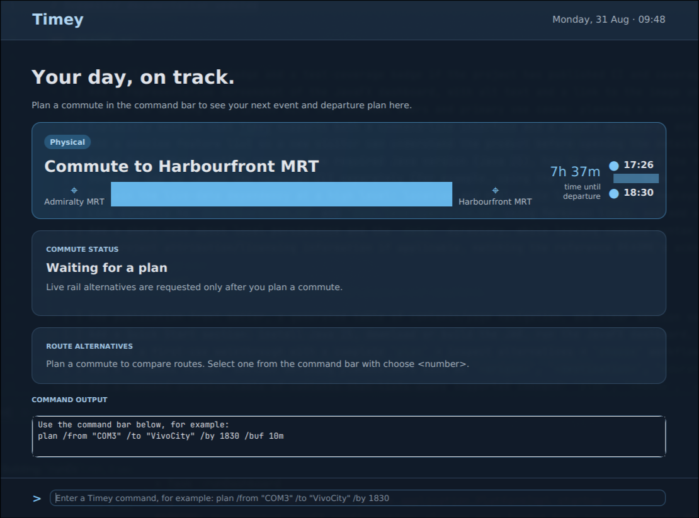

# Timey

Timey is a Java desktop commute planner for commuters, workers, and students
travelling to in-person events. It combines a fast command-line interface (CLI)
with a JavaFX dashboard: use the CLI for entering commands quickly, or use the
dashboard to review plans, route alternatives, and departure recommendations at
a glance.

Timey helps you:

- Plan a journey to reach a destination by a target arrival time.
- Compare live rail route alternatives and their walking, transit, and transfer
  details.
- Calculate a recommended leave-by time with a personal buffer.
- Save fixed commute timings for frequently used routes.
- Review upcoming saved plans and the next departure recommendation.



Live OneMap route and location lookups are used when available. When live data
cannot be retrieved, Timey retains valid prior state and offers a deterministic
offline estimate using a one-hour travel buffer.

See the [User Guide](docs/UserGuide.md) for commands and setup, and the
[Developer Guide](docs/DeveloperGuide.md) for architecture and test guidance.

## Quick start

1. Install Java 25 or a compatible JDK.
2. From the project root, build the executable fat JAR:

   ```bash
   ./gradlew shadowJar
   ```

3. Launch the JavaFX dashboard:

   ```bash
   java -jar ./release/Timey-0.1.0-all.jar
   ```

4. To use the terminal CLI instead, run:

   ```bash
   ./gradlew run
   ```

   Type `help` to see the available commands. See the
   [User Guide](docs/UserGuide.md) for the complete command reference.

## Build and run the fat JAR

Build the executable fat JAR with the Gradle wrapper:

```bash
./gradlew shadowJar
```

The generated file is placed at:

```text
./release/Timey-0.1.0-all.jar
```

Run the JavaFX dashboard with:

```bash
java -jar ./release/Timey-0.1.0-all.jar
```

The JAR includes the project’s runtime dependencies, so no separate dependency
JARs are needed. The machine running it must still have a compatible Java
runtime installed.
